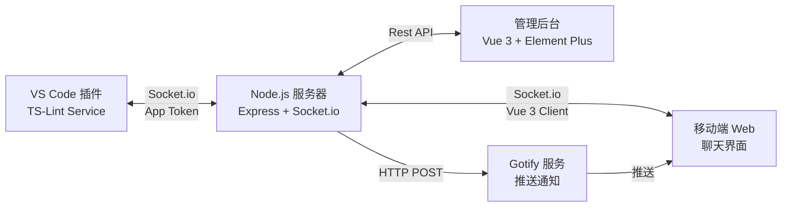

# Stealth Chat (Monorepo)

一个隐蔽的实时聊天系统,伪装成 VS Code 的 TS-Lint 插件,支持 VS Code 与移动端之间的双向通信。

## 📋 项目概述

### 核心设计理念

**隐蔽性**: 将聊天功能伪装成开发工具(TS-Lint 服务),在 VS Code 中通过 Output Channel 和 Status Bar 展示消息,外观上与普通的代码检查工具无异。

**实时通信**: 基于 Socket.io 实现 VS Code 插件与移动端 Web 界面之间的实时双向消息传递。

**推送通知**: 集成 Gotify 服务,当 VS Code 发送消息时,自动向移动端推送通知,确保消息及时送达。

**多应用支持**: 支持创建多个独立的聊天频道（App），每个频道拥有独立的 Token 和 Gotify 推送配置，互不干扰。

### 应用场景

- 在工作环境中进行隐蔽的即时通讯
- 远程协作时的私密沟通渠道
- 需要低调通信的场景

## 🏗️ 系统架构



## 🔧 核心模块详解

### 1. VS Code 插件模块 (`extension/`)

**伪装策略**:
- 插件名称: `TS-Lint Service`
- 使用 Output Channel 显示消息,格式化为类似 Lint 日志的样式
- Status Bar 显示连接状态和未读消息数
- 快捷键 `Ctrl+Shift+T` 触发消息发送

### 2. 服务端模块 (`server/`)

**功能**:
- **Socket.io 服务**: 处理多频道实时通信。
- **Admin API**: 提供系统状态监控和应用配置管理 (`/api/admin`).
- **动态配置**: 支持在线添加/删除聊天应用,配置热更新。

**Web 界面**:
- **前台聊天** (`/`): 基于 **Vue 3** 重构的隐蔽聊天界面，保持 VS Code 风格。
- **后台管理** (`/admin`): 基于 **Vue 3 + Element Plus** 的可视化管理后台，用于管理 App 和 Token。

### 3. 配置系统 (`server/src/config.js`)

系统支持两种配置方式,优先级如下:

1.  **持久化配置** (`server/data/apps.json`): 通过 Admin 后台所做的修改会且仅会保存在此文件中。
2.  **环境变量种子** (`APP_APPS`): 如果持久化配置文件不存在,系统会尝试解析环境变量中的 JSON 字符串作为初始配置。

### 4. Gotify 推送集成

每个聊天频道(App)都可以独立配置 Gotify Token。
- Server 检测到 VS Code 发送消息时，根据当前频道的配置向 Gotify 发送推送请求。
- 手机端收到 Gotify 通知，点击跳转到对应的聊天页面。

## 🛠️ 技术栈

### 前端 (Web)
- **核心框架**: Vue 3 (Composition API)
- **UI 库**: Element Plus (仅管理后台)
- **样式**: 自定义 CSS (前台), Element Plus Theme (后台)

### 服务端
- **运行时**: Node.js
- **框架**: Express
- **实时通信**: Socket.io
- **数据库**: SQLite (via sql.js)

### 部署
- **容器化**: Docker + Docker Compose

## 🚀 快速启动

### Docker 部署 (推荐)

#### 1. 启动服务

```powershell
docker-compose up -d --build
```

#### 2. 管理后台 (Admin UI)

1.  访问 `http://localhost:3000/admin`
2.  默认密码: `admin` (可通过 `.env` 修改 `ADMIN_PASSWORD`)
3.  **创建应用**:
    *   点击 "Add App"
    *   输入 ID (如 `secret_channel`) 和 Name
    *   点击 "Gen" 生成随机 Token (保存好这个 Token!)
    *   (可选) 填入 Gotify Token

#### 3. 访问聊天客户端

1.  访问 `http://localhost:3000`
2.  输入刚才生成的 **Token**
3.  开始聊天

## 📝 开发指南

### 目录结构

```
vscode-stealth-chat/
├── extension/                    # VS Code 插件
├── server/                       # Node.js 服务器
│   ├── src/
│   │   ├── routes/              # API 路由
│   │   ├── public/              # 静态资源
│   │   │   ├── admin/           # 管理后台 (Vue 3 + Element Plus)
│   │   │   ├── css/             # 公共样式
│   │   │   └── index.html       # 聊天前台 (Vue 3)
│   │   ├── config.js            # 配置管理
│   │   └── ...
│   └── data/                    # 持久化数据 (需挂载卷)
└── docker-compose.yml
```

### 修改前端

由于使用了 Vue 3 CDN 模式，无需构建步骤。

1.  编辑 `server/src/public/index.html` (聊天) 或 `server/src/public/admin/index.html` (后台)。
2.  刷新浏览器即可看到变更。

### 环境变量 (`.env`)

```bash
# 管理后台密码
ADMIN_PASSWORD=admin

# 默认应用的配置 (仅初始化时使用)
APP_APPS='[{"id":"default","name":"Default","token":"ChangeMe"}]'

# Gotify 全局配置
GOTIFY_URL=http://gotify:80/message
```
