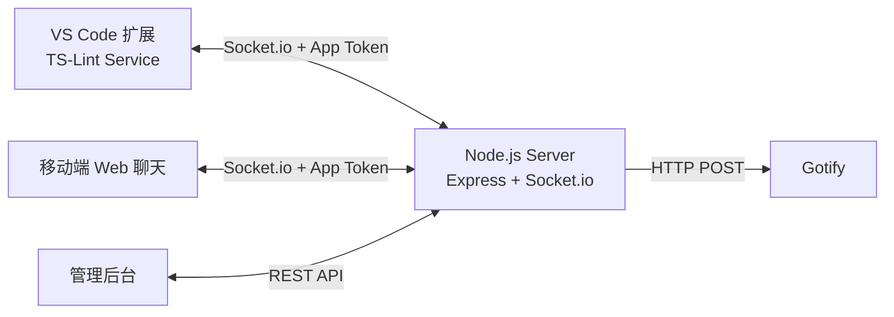

# Stealth Chat (Monorepo)

一个伪装成 VS Code TS-Lint 服务的实时聊天系统，支持 VS Code 扩展端与移动端网页双向通信，并可按应用（App）隔离消息与推送配置。

## 功能概览

- 伪装形态：扩展名称与交互文案均为 `TS-Lint Service`
- 实时通信：基于 Socket.io 的双向消息同步
- 多应用隔离：按 App Token 分房间通信，不同 App 消息互不可见
- 图片消息：支持粘贴/相册/拍照，自动按大小走 inline 或文件存储
- 消息持久化：`sql.js` + SQLite 文件落盘
- 管理后台：Web 管理 App、Token、Gotify 配置、管理员密码
- 推送通知：VS Code 侧发言可触发 Gotify 推送

## 系统架构



## 仓库结构

```text
vscode-stealth-chat/
├── extension/                  # VS Code 扩展（TypeScript + Webview）
├── server/                     # Node.js 服务端
│   ├── src/
│   │   ├── routes/            # Admin / Upload API
│   │   ├── public/            # Web 聊天 + Admin 前端（Vue3 CDN）
│   │   ├── services/          # Gotify 集成
│   │   ├── db.js              # 消息存储与封存策略
│   │   ├── config.js          # App 配置持久化与加载
│   │   └── settings.js        # 管理员密码与会话令牌
│   └── data/                  # 运行时数据（卷挂载）
├── packages/                  # 跨端共享协议与消息核心
│   ├── protocol/              # Socket 事件常量与 ACK 结构
│   └── chat-core/             # 消息去重/排序/ID/常量等纯逻辑
├── docker-compose.yml
└── restart-deploy.sh          # 服务器更新后的一键重启脚本
```

## 快速启动（Docker）

### 1. 准备环境变量

```bash
cp .env.example .env
```

### 2. 启动服务

```bash
docker compose up -d --build
```

### 3. 访问入口

- 聊天前台：`http://localhost:3000/#/`
- 管理后台：`http://localhost:3000/#/admin`
- Gotify：`http://localhost:8080`

## 管理后台与 App 配置

1. 打开 `http://localhost:3000/#/admin`
2. 默认管理员密码：`admin`
3. 在后台创建 App（`id/name/token`，可选 `gotifyToken/gotifyUrl/gotifyPriority/clickUrl`）
4. 扩展端和移动端都使用该 App 的 `token` 建立连接

## 配置优先级

App 配置加载顺序：

1. `server/data/apps.json`（后台管理后持久化）
2. `APP_APPS`（仅在 `apps.json` 不存在时作为初始化种子）
3. 兼容兜底：`STEALTH_SECRET`（生成默认 app）

## 关键环境变量

`docker-compose.yml` 当前使用的核心变量：

- `APP_APPS`：多 App 初始化 JSON（仅首次生效）
- `STEALTH_SECRET`：默认 app 的兼容 token
- `GOTIFY_URL`：Gotify 推送地址
- `GOTIFY_TOKEN`：兼容旧版默认 app 的 Gotify token
- `CLICK_URL`：通知点击跳转地址
- `MESSAGE_RETENTION_DAYS`：消息按时间封存阈值
- `MESSAGE_MAX_COUNT`：每个 App 热数据最大保留消息数
- `ARCHIVE_DB_PATH`：归档数据库路径（可选）
- `GOTIFY_PASS`：Gotify 管理员密码（作用于 gotify 容器）

## 数据存储与持久化

聊天与配置数据默认保存在以下目录（由 `docker-compose.yml` 挂载）：

- `server/data/messages.db`：聊天消息数据库
- `server/data/messages.archive.db`：封存消息数据库
- `server/data/apps.json`：App 配置
- `server/data/settings.json`：管理员密码哈希
- `server/data/images/`：大图文件存储
- `gotify_data/`：Gotify 自身数据

## 数据库迁移与升级

后续会频繁进行数据库结构与消息 payload 升级，统一采用“先迁移数据库，再升级服务代码”的流程，不再依赖运行时兼容分支。

推荐发布顺序：

1. 先执行迁移脚本（可先 dry-run）：

```bash
cd server
npm run db:migrate:payload-v2 -- --dry-run
npm run db:migrate:payload-v2
```

2. 确认迁移完成后，再按标准流程重启部署最新代码。

## 代码更新后的标准发布

拉完最新代码后，在项目根目录执行：

```bash
bash restart-deploy.sh
```

脚本会自动执行：

1. 检查运行环境与目录
2. 备份 `server/data`、`gotify_data`、`.env` 到 `backup/<timestamp>/`
3. 若 `chat-server` 正在运行，先发送 `SIGINT` 优雅停机，再执行 `stop`
4. `docker compose up -d --build` 重建并启动
5. 检查 `http://127.0.0.1:3000/health`
6. 输出 `docker compose ps`

可选参数：

```bash
SKIP_BACKUP=1 bash restart-deploy.sh
SKIP_HEALTHCHECK=1 bash restart-deploy.sh
HEALTH_URL=http://127.0.0.1:3000/health bash restart-deploy.sh
```

## 本地开发

## 工程规范与质量门禁

仓库根目录新增统一工程脚本：

```bash
npm run lint
npm run format:check
npm run typecheck
npm run test
npm run ci:check
```

说明：

- `lint`：静态检查（server / packages / extension ts）
- `format:check`：Prettier 格式一致性检查
- `typecheck`：扩展端类型检查 + 协议边界 smoke tests
- `test`：后端数据库测试
- `ci:check`：本地一次性跑完整门禁，CI 同步执行

提交前默认会触发 `husky + lint-staged` 进行增量检查。
详细规范见：`docs/development-standards.md`。

### Server

```bash
cd server
npm install
npm run dev
```

### Extension

```bash
cd extension
npm install
npm run watch
```

在 VS Code 中按 `F5` 启动 Extension Development Host 进行调试。

## VS Code 扩展配置（`tsLint.*`）

常用项：

- `tsLint.serverUrl`：服务端地址
- `tsLint.connections`：连接列表（name/serverUrl/token）
- `tsLint.activeConnection`：当前连接
- `tsLint.forceWebsocket`：是否强制 websocket 传输
- `tsLint.displayMode`：`bubble | log`
- `tsLint.backgroundSyncEnabled`：是否开启后台增量同步
- `tsLint.backgroundSyncIntervalMs`：后台轮询间隔（默认 4000ms）

默认发送命令：`Ctrl+Shift+T`（macOS：`Cmd+Shift+T`）

## Socket 事件

客户端 -> 服务端：

- `chat message`
- `load history`
- `load more history`

服务端 -> 客户端：

- `chat message`
- `history loaded`
- `more history loaded`

## HTTP API

### 管理后台 API

- `POST /api/admin/login`
- `GET /api/admin/status`
- `POST /api/admin/apps`
- `PUT /api/admin/apps/:id`
- `DELETE /api/admin/apps/:id`
- `POST /api/admin/password`
- `GET /api/admin/archive/messages`
- `POST /api/admin/archive/restore`

### 上传 API

- `POST /api/upload`
  - 需要 `Authorization: Bearer <app-token>`

### 后台同步 API

- `POST /api/sync/session`
- `POST /api/sync/pull`
- `POST /api/sync/refresh`
- `POST /api/sync/close`

### 健康检查

- `GET /health`

## 消息封存策略

- 时间维度：超过 `MESSAGE_RETENTION_DAYS` 的消息会从热库转移到归档库（默认 30 天）
- 数量维度：每个 App 热库最多保留 `MESSAGE_MAX_COUNT` 条，超出部分转移到归档库（默认 1000）
- 清理任务：每小时执行一次封存搬迁
- 默认展示：聊天历史仅显示热库消息，归档消息默认不展示
- 恢复机制：可通过管理 API 将归档消息恢复到热库
- 自动落盘：每 5 分钟执行，优雅停机会额外触发一次落盘
