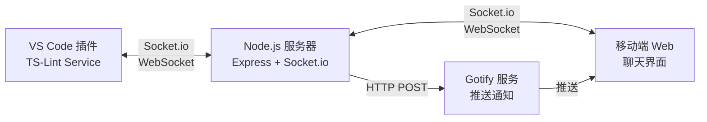
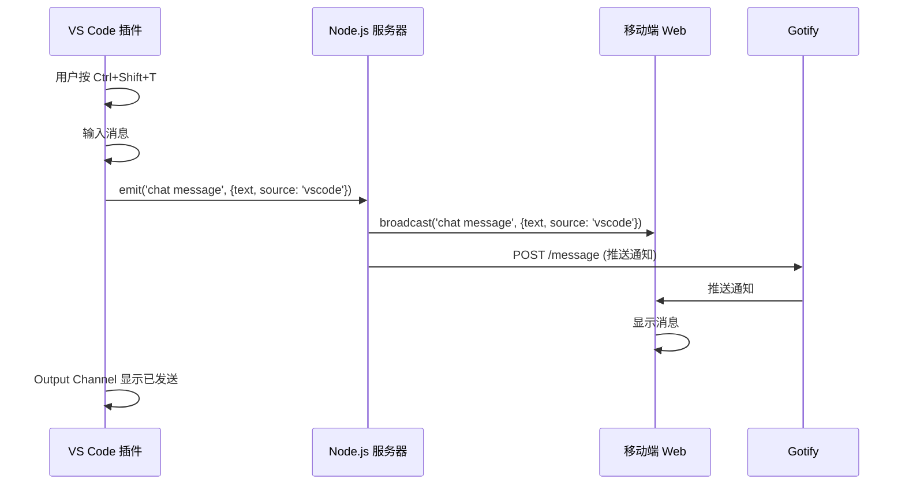
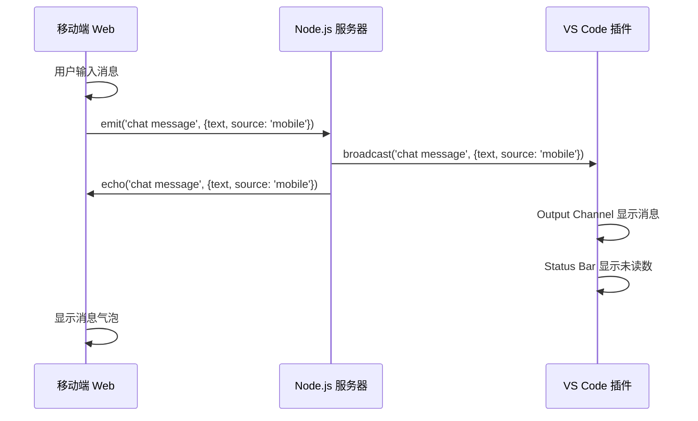

# Stealth Chat (Monorepo)

一个隐蔽的实时聊天系统,伪装成 VS Code 的 TS-Lint 插件,支持 VS Code 与移动端之间的双向通信。

## 📋 项目概述

### 核心设计理念

**隐蔽性**: 将聊天功能伪装成开发工具(TS-Lint 服务),在 VS Code 中通过 Output Channel 和 Status Bar 展示消息,外观上与普通的代码检查工具无异。

**实时通信**: 基于 Socket.io 实现 VS Code 插件与移动端 Web 界面之间的实时双向消息传递。

**推送通知**: 集成 Gotify 服务,当 VS Code 发送消息时,自动向移动端推送通知,确保消息及时送达。

**消息持久化**: 使用 SQLite 数据库自动保存所有聊天消息,支持历史消息查询和加载,默认保留最近 1000 条或 30 天内的消息。

### 应用场景

- 在工作环境中进行隐蔽的即时通讯
- 远程协作时的私密沟通渠道
- 需要低调通信的场景

## 🏗️ 系统架构



### 架构层次

1. **客户端层**
   - **VS Code 插件**: 伪装成 TS-Lint 服务的聊天客户端
   - **移动端 Web**: 提供完整聊天界面的单页应用

2. **服务层**
   - **Node.js 服务器**: 处理 WebSocket 连接和消息转发
   - **Gotify 服务**: 提供推送通知功能

3. **通信层**
   - **Socket.io**: 实现实时双向通信
   - **HTTP**: 用于推送通知和静态资源服务

## 🔧 核心模块详解

### 1. VS Code 插件模块 (`extension/`)

**伪装策略**:

- 插件名称: `TS-Lint Service`
- 使用 Output Channel 显示消息,格式化为类似 Lint 日志的样式
- Status Bar 显示连接状态和未读消息数
- 快捷键 `Ctrl+Shift+T` 触发消息发送

**关键实现**:

- **连接管理**: 使用 Socket.io Client 连接到服务器,支持自动重连
- **认证**: 通过 `auth.token` 传递共享密钥进行身份验证
- **消息处理**:
  - 发送: 通过 Input Box 输入,emit `chat message` 事件
  - 接收: 监听 `chat message` 事件,追加到 Output Channel
- **状态指示**:
  - 未读消息时 Status Bar 显示警告样式
  - 点击 Status Bar 打开 Output Channel 并清除未读状态

**核心文件**:

- [`extension.ts`](file:///f:/github/vscode-stealth-chat/extension/src/extension.ts): 插件主逻辑
- [`package.json`](file:///f:/github/vscode-stealth-chat/extension/package.json): 插件配置和命令定义

### 2. 服务端模块 (`server/`)

**职责**:

- 管理 Socket.io 连接和房间
- 转发客户端之间的消息
- 触发 Gotify 推送通知

**架构设计**:

```
server/
├── src/
│   ├── index.js          # Express 服务器入口
│   ├── socket.js         # Socket.io 连接和消息处理
│   ├── db.js             # SQLite 数据库模块
│   ├── test-db.js        # 数据库单元测试
│   ├── services/
│   │   └── gotify.js     # Gotify 推送服务封装
│   └── public/
│       └── index.html    # 移动端 Web 界面
```

**关键实现**:

**认证中间件** ([`socket.js`](file:///f:/github/vscode-stealth-chat/server/src/socket.js#L14-L22)):

```javascript
io.use((socket, next) => {
  const token = socket.handshake.auth.token;
  if (token === CHAT_SECRET) {
    next();
  } else {
    next(new Error("Unauthorized"));
  }
});
```

**消息转发逻辑**:

- 接收到消息后广播给所有已连接客户端
- 自动保存消息到 SQLite 数据库
- 识别消息来源 (`vscode` 或 `mobile`)
- VS Code 发送的消息触发 Gotify 推送

**历史消息加载**:

- 客户端连接后可请求历史消息 (`load history` 事件)
- 支持限制返回数量(默认 50 条)
- VS Code 插件自动加载并显示历史消息

### 3. 移动端 Web 界面 (`server/src/public/index.html`)

**功能特性**:

- 🔐 **密钥认证**: 输入共享密钥连接服务器
- 💾 **记住密钥**: 可选择本地保存密钥(Base64 编码)
- 🔒 **安全锁定**: 5 次失败尝试后锁定 60 秒
- 💬 **实时聊天**: 支持多行输入,Enter 发送,Shift+Enter 换行
- 📱 **响应式设计**: 适配移动端和桌面端
- 🎨 **暗色主题**: VS Code 风格的深色界面

**UI 组件**:

- **认证界面**: 密钥输入、记住选项、安全提示
- **聊天界面**: 消息列表、输入框、状态指示
- **消息气泡**: 区分自己/对方/系统消息

### 4. Gotify 推送集成 (`server/src/services/gotify.js`)

**推送策略**:

- 仅当 VS Code 发送消息时触发推送
- 推送内容包含消息标题和正文
- 支持 Android 点击跳转(通过 `intentUrl`)

**配置参数**:

- `GOTIFY_URL`: Gotify 服务地址
- `GOTIFY_TOKEN`: 应用令牌
- `CLICK_URL`: 点击通知后打开的 URL

## 🛠️ 技术栈

### VS Code 插件

- **语言**: TypeScript
- **框架**: VS Code Extension API
- **通信**: Socket.io Client 4.7.0

### 服务端

- **运行时**: Node.js
- **框架**: Express 4.18
- **实时通信**: Socket.io 4.7
- **HTTP 客户端**: Axios 1.6
- **数据库**: sql.js 1.10 (纯 JavaScript SQLite)

### 移动端

- **技术**: 原生 HTML5 + CSS3 + JavaScript
- **通信**: Socket.io Client (CDN)

### 部署

- **容器化**: Docker + Docker Compose
- **推送服务**: Gotify Server

## 📡 数据流

### 消息发送流程 (VS Code → 移动端)



### 消息接收流程 (移动端 → VS Code)



## 🔐 安全机制

### 认证方式

- **共享密钥**: 所有客户端使用相同的密钥 (`STEALTH_SECRET`)
- **Socket.io 认证**: 通过 `handshake.auth.token` 验证
- **连接拦截**: 未授权连接直接拒绝

### 移动端安全

- **密钥加密存储**: 使用 Base64 编码(防止明文查看)
- **失败锁定**: 5 次失败后锁定 60 秒
- **锁定持久化**: 锁定状态保存在 localStorage

### 建议增强

- [ ] 使用 HTTPS/WSS 加密传输
- [ ] 实现端到端加密
- [ ] 添加用户级别的认证
- [ ] 实现消息过期机制

## 📂 代码结构

```
vscode-stealth-chat/
├── extension/                    # VS Code 插件
│   ├── src/
│   │   └── extension.ts         # 插件主逻辑 (185 行,含历史加载)
│   ├── package.json             # 插件配置
│   └── tsconfig.json            # TypeScript 配置
│
├── server/                       # Node.js 服务器
│   ├── src/
│   │   ├── index.js             # 服务器入口 (38 行,含健康检查)
│   │   ├── socket.js            # Socket.io 逻辑 (67 行,含数据库集成)
│   │   ├── db.js                # SQLite 数据库模块 (230 行)
│   │   ├── test-db.js           # 数据库单元测试 (125 行)
│   │   ├── services/
│   │   │   └── gotify.js        # Gotify 集成 (36 行)
│   │   └── public/
│   │       └── index.html       # 移动端界面 (878 行)
│   ├── package.json             # 服务端依赖
│   ├── nodemon.json             # Nodemon 配置
│   ├── .env.development         # 开发环境变量
│   ├── Dockerfile               # 服务端镜像
│   └── data/                    # 数据库文件目录
│
├── scripts/                      # 工具脚本
│   ├── verify.sh                # Linux/Mac 验证脚本
│   └── verify.ps1               # Windows 验证脚本
│
├── docker-compose.yml            # 部署配置
├── .env.example                  # 环境变量模板
├── DEVELOPMENT.md                # 本地开发指南
└── README.md                     # 本文档
```

### 关键文件说明

| 文件                                                                                                   | 行数 | 职责                                                       |
| ------------------------------------------------------------------------------------------------------ | ---- | ---------------------------------------------------------- |
| [`extension/src/extension.ts`](file:///f:/github/vscode-stealth-chat/extension/src/extension.ts)       | 185  | VS Code 插件核心逻辑,处理连接、消息收发、历史加载、UI 更新 |
| [`server/src/index.js`](file:///f:/github/vscode-stealth-chat/server/src/index.js)                     | 38   | Express 服务器入口,数据库初始化,健康检查端点               |
| [`server/src/socket.js`](file:///f:/github/vscode-stealth-chat/server/src/socket.js)                   | 67   | Socket.io 服务器,处理认证、消息转发、数据库存储、推送触发  |
| [`server/src/db.js`](file:///f:/github/vscode-stealth-chat/server/src/db.js)                           | 230  | SQLite 数据库模块,消息持久化、查询、自动清理               |
| [`server/src/services/gotify.js`](file:///f:/github/vscode-stealth-chat/server/src/services/gotify.js) | 36   | Gotify 推送服务封装,支持 Android 点击跳转                  |
| [`server/src/public/index.html`](file:///f:/github/vscode-stealth-chat/server/src/public/index.html)   | 878  | 移动端单页应用,包含认证、聊天、安全锁定等功能              |

## 🚀 快速启动

### 方式一: 本地开发模式(推荐用于开发)

**优势**: 30 秒快速启动,自动重启,无需 Docker

```bash
# 1. 安装依赖
cd server
npm install

# 2. 启动开发服务器
npm run dev

# 3. 测试健康检查
curl http://localhost:3000/health
```

详见 [`DEVELOPMENT.md`](file:///f:/github/vscode-stealth-chat/DEVELOPMENT.md)

### 方式二: Docker 部署(推荐用于生产)

#### 1. 环境准备

- 确保已安装 Docker 和 Docker Compose
- 复制 `.env.example` 为 `.env` 并按需修改

#### 2. 启动服务

在根目录下运行:

```powershell
docker-compose up -d --build
```

### 3. 访问客户端

**移动端**:

1.  访问 `http://localhost:3000` (或服务器 IP:3000)
2.  输入密钥 (默认: `ChangeMeInProduction`)
3.  可选择"记住密钥"以便下次自动填充

**Gotify 管理**:

- 访问 `http://localhost:8080`
- 默认账号: `admin` / `admin`
- 创建应用并获取 Token,更新到 `.env` 的 `GOTIFY_TOKEN`

### 4. 配置 VS Code 插件

**开发模式**:

1.  在 VS Code 中打开 `extension/` 目录
2.  按 `F5` 启动调试
3.  在新窗口中测试插件

**生产模式**:

1.  编译插件: `cd extension && npm run compile`
2.  打包: `vsce package`
3.  安装 `.vsix` 文件

**配置参数**:

- 打开 VS Code 设置,搜索 `tsLint`
- `Server Url`: `http://localhost:3000`
- `Secret`: `ChangeMeInProduction` (必须与 `.env` 中的 `STEALTH_SECRET` 一致)

### 5. 使用插件

- **发送消息**: 按 `Ctrl+Shift+T` (Mac: `Cmd+Shift+T`)
- **查看消息**: 点击右下角 Status Bar 的 `TS-Lint` 图标
- **查看历史**: 在 Output Channel 中滚动查看

## 🔧 配置说明

### 环境变量 (`.env`)

```bash
# Gotify 管理员密码
GOTIFY_PASS=admin

# Gotify 应用 Token (在 Gotify 管理界面创建应用后获取)
GOTIFY_TOKEN=Ahc7pv3uyv4rtv9

# 共享密钥 (所有客户端必须一致)
STEALTH_SECRET=ChangeMeInProduction

# 数据库配置 (可选,使用默认值即可)
MESSAGE_RETENTION_DAYS=30    # 消息保留天数
MESSAGE_MAX_COUNT=1000       # 最大消息数量
```

### Docker Compose 配置

**服务组成**:

- `gotify`: Gotify 推送服务 (端口 8080)
- `chat-server`: Stealth Chat 服务器 (端口 3000)

**数据持久化**:

- Gotify 数据存储在 `./gotify_data/`
- 聊天消息数据库存储在 `./server/data/messages.db`

## 📝 开发指南

### 本地开发工作流

**推荐流程**:

1. 修改代码
2. 本地开发模式自动重启 (`npm run dev`)
3. 运行验证脚本确保不破坏功能
4. 提交代码

**验证脚本**:

```bash
# Windows
.\scripts\verify.ps1

# Linux/Mac
./scripts/verify.sh
```

验证脚本会执行:

- ✅ 代码语法检查
- ✅ 单元测试
- ✅ 服务启动测试
- ✅ 健康检查端点测试

### 修改插件

1. 编辑 [`extension/src/extension.ts`](file:///f:/github/vscode-stealth-chat/extension/src/extension.ts)
2. 运行 `npm run compile` 编译
3. 按 `F5` 调试

### 修改服务端

**本地开发**:

1. 编辑 `server/src/` 下的文件
2. Nodemon 自动重启服务
3. 查看控制台日志

**Docker 部署**:

1. 编辑 `server/src/` 下的文件
2. 重启服务: `docker-compose restart chat-server`
3. 查看日志: `docker-compose logs -f chat-server`

### 修改移动端界面

1. 编辑 [`server/src/public/index.html`](file:///f:/github/vscode-stealth-chat/server/src/public/index.html)
2. 刷新浏览器即可看到更改

### 数据库管理

**查看数据库**:

```bash
# 使用 SQLite 客户端
sqlite3 server/data/messages.db

# 查询消息
SELECT * FROM messages ORDER BY timestamp DESC LIMIT 10;
```

**清空数据库**:

```bash
rm server/data/messages.db
# 重启服务会自动创建新数据库
```

## 🤖 AI 阅读指南

### 项目定位

这是一个**隐蔽通信工具**,核心在于伪装和实时性。

### 技术亮点

1. **伪装设计**: VS Code 插件伪装成 Lint 工具
2. **实时通信**: Socket.io 实现低延迟双向消息
3. **推送集成**: Gotify 确保移动端消息送达
4. **安全机制**: 共享密钥 + 失败锁定

### 扩展方向

- 添加端到端加密
- 支持多用户/多房间
- 实现消息历史持久化
- 添加文件传输功能
- 支持更多客户端(浏览器插件、桌面应用)

### 关键设计决策

- **为何使用 Socket.io**: 需要实时双向通信,WebSocket 是最佳选择
- **为何集成 Gotify**: 移动端需要推送通知,Gotify 是开源自托管方案
- **为何伪装成 Lint**: Output Channel 是 VS Code 中最不引人注目的消息展示方式
- **为何使用共享密钥**: 简化部署,适合小团队使用
