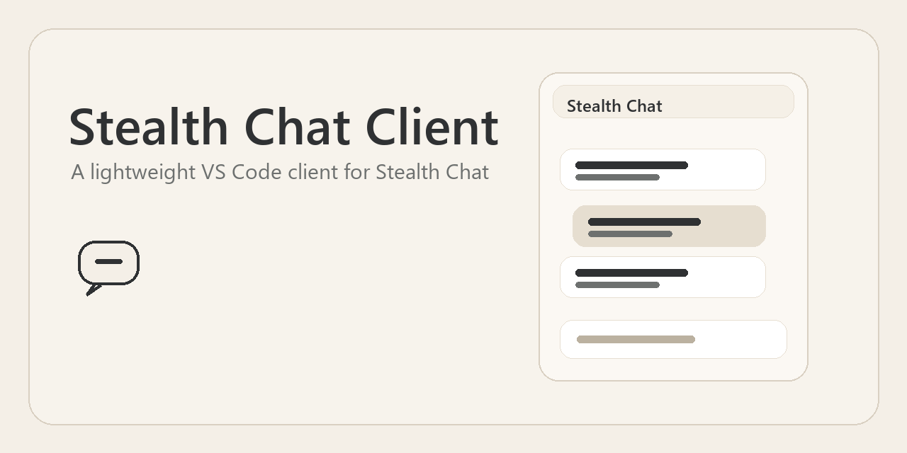
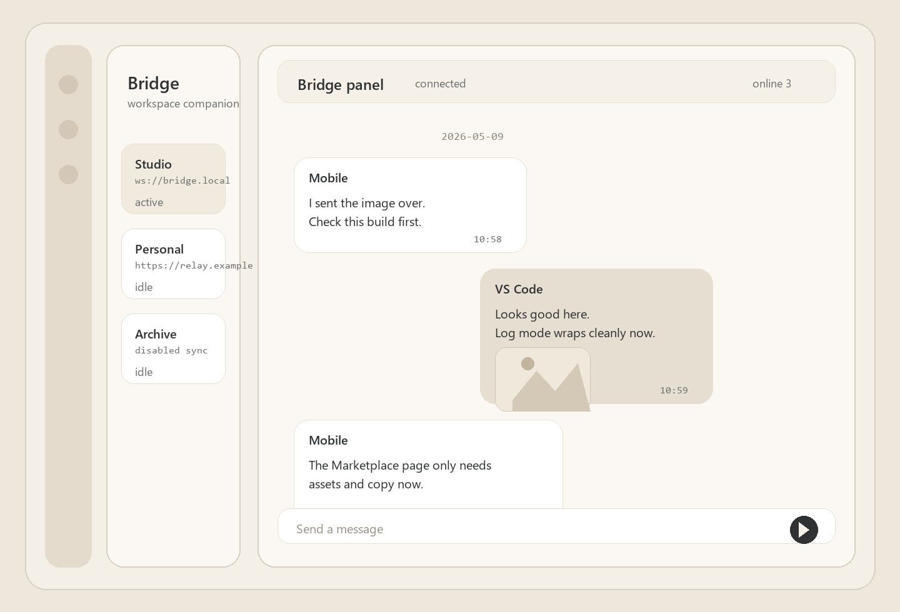
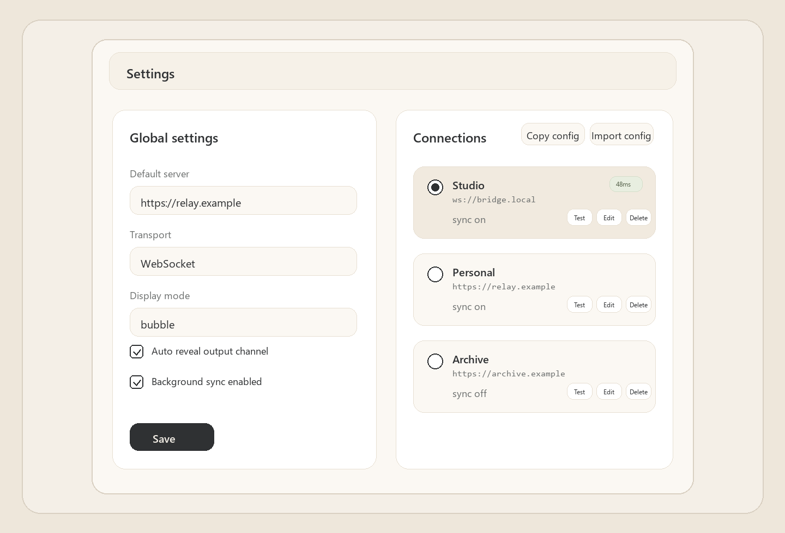

# Stealth Chat Client

A lightweight VS Code client for Stealth Chat.

Stealth Chat Client brings an existing Stealth Chat server into VS Code. It is designed as a companion client, not a standalone messaging service.

## Features

- Real-time messaging inside VS Code
- Inline image messages with preview support
- Multiple saved connections with quick switching
- Bubble and compact log display modes
- Optional background sync for configured connections

## Screenshots

## Quick Start

1. Make sure your Stealth Chat server is already running.
2. Open the `Bridge` view from the Activity Bar.
3. Configure `stealthChat.serverUrl` and at least one item in `stealthChat.connections`.
4. Pick the active connection and start chatting.

## Connection Prerequisites

This extension expects an existing Stealth Chat server. It does not provision a server for you.

The Activity Bar entry is intentionally labeled `Bridge` to keep the in-editor entry less conspicuous.

For server setup and deployment details, see the monorepo guide:

- [Project README](https://github.com/Sisyphean-a/vscode-stealth-chat#readme)

## Settings

- `stealthChat.serverUrl`: default server URL used when a connection does not override it
- `stealthChat.secret`: fallback token for the default connection path
- `stealthChat.forceWebsocket`: force WebSocket transport
- `stealthChat.autoReveal`: reveal the output channel when new messages arrive
- `stealthChat.displayMode`: `bubble` or `log`
- `stealthChat.connections`: saved connection list with `name`, `serverUrl`, `token`, and `backgroundSync`
- `stealthChat.activeConnection`: currently selected connection name
- `stealthChat.backgroundSyncEnabled`: toggle background sync
- `stealthChat.backgroundSyncIntervalMs`: background polling interval

Legacy `tsLint.*` settings are migrated on activation and still readable for compatibility.

## Images And Sync

- Image messages are supported in both chat and compact log views.
- Large images can be uploaded through the connected server and previewed from the chat view.
- Background sync keeps configured conversations updated even when the main view is not focused.

## Support

- [Support guide](SUPPORT.md)
- [GitHub Issues](https://github.com/Sisyphean-a/vscode-stealth-chat/issues)
